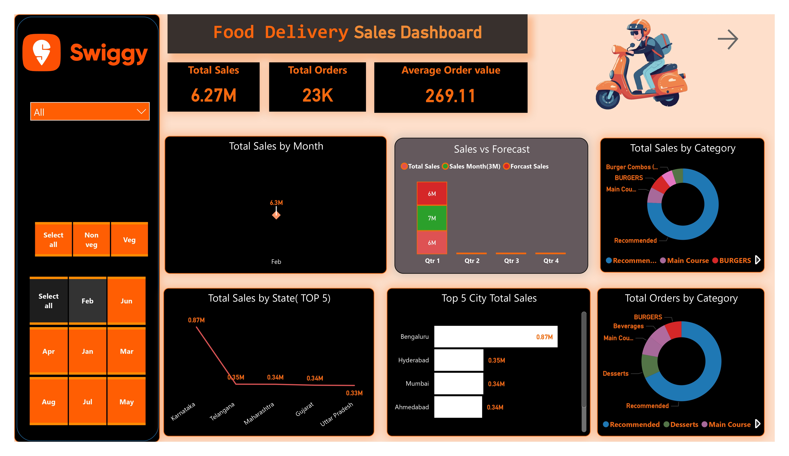
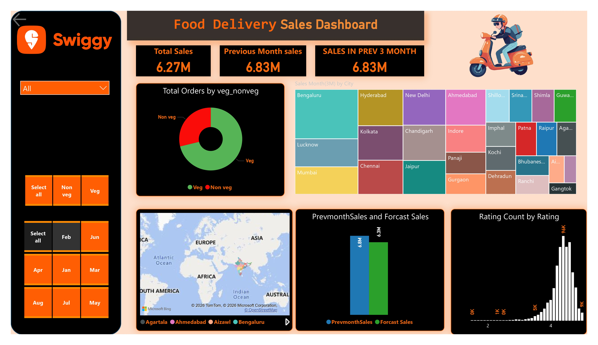

# 📊 Food Delivery Sales Dashboard Report

## 🧾 Project Title

**Food Delivery Sales Analysis using Power BI**

---

## 📌 Dashboard Preview

---

## 📌 Introduction

This project focuses on analyzing food delivery data using **Power BI** to generate meaningful insights about sales performance, customer behavior, and operational trends. The dashboard provides a clear overview of key business metrics such as total sales, orders, and category-wise performance.

---

## 🎯 Objectives

* Analyze total sales and order trends
* Identify top-performing cities and states
* Understand customer preferences (Veg vs Non-Veg)
* Compare sales with forecast data
* Evaluate category-wise performance
* Monitor monthly and quarterly trends

---

## 🛠️ Tools & Technologies

* Power BI Desktop
* Data Visualization Techniques
* Data Cleaning & Transformation

---

## 📊 Key Metrics (KPIs)

* 💰 **Total Sales:** 6.27 Million
* 📦 **Total Orders:** 23K
* 💵 **Average Order Value:** 269.11
* 📉 **Previous Month Sales:** 6.83 Million

---

## 📈 Sales Analysis

### Monthly Sales

* Highest sales observed around **February (~6.3M)**
* Sales fluctuate across months indicating seasonal demand

---

### Sales vs Forecast

* Comparison between actual sales and forecast shows:

  * Slight variation across quarters
  * Useful for business planning and demand prediction

---

## 🌍 Geographic Analysis

### Top Performing Cities

* 🥇 Bengaluru – 0.87M
* 🥈 Hyderabad – 0.35M
* 🥉 Mumbai – 0.34M
* Ahmedabad – 0.34M

---

### Top Performing States

* Karnataka – Highest sales
* Telangana
* Maharashtra
* Gujarat
* Uttar Pradesh

---

## 🍔 Category Analysis

### Top Categories

* Recommended
* Main Course
* Burgers
* Desserts
* Beverages

👉 **Insight:** Main Course and Recommended items generate the highest revenue.

---

## 🥗 Veg vs Non-Veg Analysis

* Orders categorized into:

  * Veg
  * Non-Veg
* Helps understand customer dietary preferences

---

## ⭐ Customer Rating Analysis

* Majority ratings fall in:

  * 4-star and 5-star categories
* Indicates high customer satisfaction

---

## 📉 Trend Analysis

* Sales in previous 3 months show consistency
* Slight drop from previous month (6.83M → 6.27M)

---

## 🔍 Key Insights

* Bengaluru is the top revenue-generating city
* Main Course dominates in sales
* Stable average order value (~269)
* Customer satisfaction is high
* Sales show seasonal variations

---

## 💡 Recommendations

* Focus marketing campaigns in top cities
* Improve low-performing regions
* Promote high-demand categories
* Use forecast data for planning
* Enhance customer experience

---

## 🚀 Conclusion

The dashboard provides a **clear, data-driven view of food delivery performance**, helping businesses make better strategic decisions.

---

## 👨‍💻 Author

**Parveen Rai** 🚀
